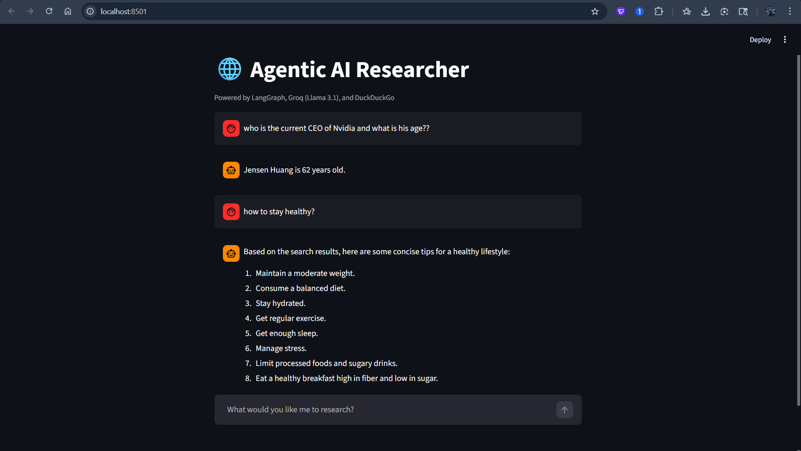
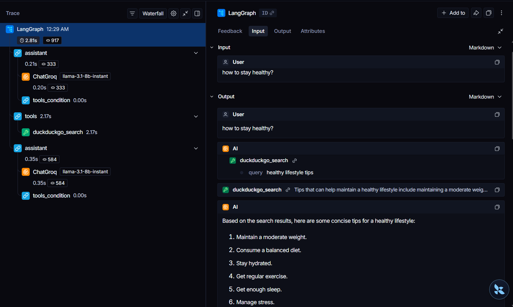

# 🤖 Agentic AI Researcher 🌐

An advanced, stateful AI agent built with **LangGraph** and **Llama 3.1**, capable of autonomous reasoning and real-time web research.

This project demonstrates enterprise-grade AI orchestration.

---

## 🚀 Overview

Traditional LLM applications follow a linear pipeline. This system implements a **ReAct (Reasoning + Acting) architecture**, enabling the agent to:

* Think before acting
* Use external tools (web search)
* Validate and refine responses iteratively

---

## ✨ Key Features

* 🧠 **Stateful Orchestration** – Maintains memory across multi-step reasoning using LangGraph
* 🔎 **Autonomous Tool Calling** – Dynamically performs web searches via DuckDuckGo
* 🛡️ **System Guardrails** – Prevents hallucinations (especially tool misuse)
* 💻 **Interactive Frontend** – Built using Streamlit
* 📊 **Observability** – Full tracing with LangSmith

---

## 🛠️ Tech Stack

| Component     | Technology                  |
| ------------- | --------------------------- |
| Orchestration | LangGraph                   |
| LLM           | Groq (Llama-3.1-8b-instant) |
| Search        | DuckDuckGo API              |
| Frontend      | Streamlit                   |
| Monitoring    | LangSmith                   |
| Backend       | Python                      |

---

## 🧩 System Architecture

The system follows a **cyclic graph-based execution flow**:

```text
User Query → Assistant Node → (Tool Decision)
              ↓                  ↓
           End Node        Tools Node (Search)
                               ↓
                        Assistant Node (Refine)
                               ↓
                            Final Output
```

### Workflow Explanation:

1. **Assistant Node**

   * Interprets user input
   * Decides whether a tool is required

2. **Conditional Edge**

   * Routes execution to either:

     * End (direct answer)
     * Tools node

3. **Tools Node**

   * Executes DuckDuckGo search
   * Returns structured results

4. **Loop Back**

   * Assistant reprocesses results
   * Produces grounded final answer

---

## 📸 Project Screenshots

### 🖥️ Agent Interface



### 🔁 LangGraph Execution Model



---

## ⚙️ Installation & Setup

### 1️⃣ Clone Repository

```bash
git clone https://github.com/YOUR_USERNAME/LangGraph_Agent.git
cd LangGraph_Agent
```

### 2️⃣ Create Virtual Environment

```bash
python -m venv venv
```

#### Activate Environment:

**Windows:**

```bash
.\venv\Scripts\activate
```

**Mac/Linux:**

```bash
source venv/bin/activate
```

---

### 3️⃣ Install Dependencies

```bash
pip install -r requirements.txt
```

---

### 4️⃣ Configure Environment Variables

Create a `.env` file in the root directory:

```env
GROQ_API_KEY=your_groq_api_key
LANGCHAIN_API_KEY=your_langsmith_api_key
LANGCHAIN_TRACING_V2=true
LANGCHAIN_PROJECT=Agentic_AI_Researcher
```

---

### 5️⃣ Run the Application

```bash
streamlit run main.py
```

---

## 💡 Engineering Decisions

### 🔁 Why LangGraph?

* Enables cyclic workflows (unlike linear LangChain)
* Ideal for iterative reasoning agents

### ⚡ Why Groq (Llama 3.1)?

* Ultra-fast inference
* Cost-efficient for production use

### 🌐 Why DuckDuckGo?

* No API key required
* Lightweight and fast for real-time retrieval

### 📊 Why LangSmith?

* Debugging complex agent flows
* Observability for enterprise systems

---

## 📌 Use Cases

* 🔍 Real-time research assistant
* 📄 Document intelligence systems
* 🤖 Autonomous AI agents
* 📊 Market & trend analysis
* 💼 Enterprise AI copilots

---

## 🚧 Future Improvements

* Add multi-tool support (APIs, databases)
* Integrate memory persistence (vector DB)
* Deploy using Docker & cloud (AWS/GCP)
* Add authentication & user sessions

---

## 🧑‍💻 Author

**Santhosh P**

Final Year Electrical and Electronics Engineering Student
Aspiring Full Stack AI Engineer 🚀

---

## ⭐ Support

If you found this project useful, consider giving it a ⭐ on GitHub!
